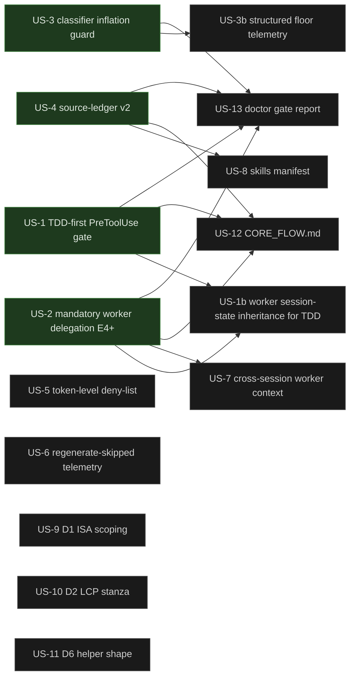

# User Stories — claude-hooks-ts

This document is the canonical backlog for closing the architectural gaps identified by the post-#46 re-audit and the core-flow verification on 2026-05-19. Each story is sized to ship as a single focused PR.

**Status legend:** `🔴 not started` · `🟡 in flight` · `🟢 shipped`

**Format:** Each story carries acceptance criteria, implementation notes with `file:line` anchors against branch `fix/audit-sprint-d1235d6` (post-PR-#48), test pattern, LOC estimate, and a risk note.

---

## Dependency graph

Build sequence — each node depends on its incoming edges landing first. Status is updated inline as stories ship so the graph doubles as a live progress board.

**Reading the graph:** an arrow `A --> B` means *B should not ship before A is merged on `main`*. Stories with no incoming arrows are independent and can ship in parallel. The four Theme A pillars (US-1 → US-4) are the foundation; downstream stories light up as they land.

**Live shipped/in-flight (auto-update on every story PR):**
- 🟢 US-3 (PR #50, merged 2026-05-19)
- 🟢 US-4 (PR #51, merged 2026-05-19)
- 🟢 US-1 (PR #52, merged 2026-05-19)
- 🟢 US-2 (PR #54, merged 2026-05-19)
- 🔴 everything else (US-1b unblocked next)

---

## Theme A — Core flow enforcement (the "design promise" stories)

These four stories collectively make the repo's enforced flow match the marketing-page promise: **RPI methodology + TDD + leveraged workers**, end-to-end, codified.

### US-1 — TDD-first PreToolUse gate 🔴

> **As** a senior engineer relying on hooks to keep an agent honest,
> **I want** writes to non-test source files denied unless a matching test was touched in the same task,
> **So that** TDD is a property of the system, not an instruction the model can ignore.

**Acceptance criteria**
1. New policy module `src/policies/tdd-gate.ts` returns `{ kind: "allow" | "deny" | "ask" }` given `{ toolName, resolvedFilePath, lastTestTouchedAt, tddGateEnabled }`.
2. The gate fires for `Write`, `Edit`, `MultiEdit`, `NotebookEdit` on paths under `src/**` when the inferred companion test (`test/**/<name>.test.ts` or `<file>.test.ts`) does not exist OR has not been modified in the current task.
3. The gate is **opt-in** by `tddGateEnabled` (default `false`) — never silent escalation.
4. Bootstrap escape: when the same tool call batch creates both the test file and the implementation file (PreToolUse sees the test path appear in `files_changed` for the same `session_id`), the write is allowed.
5. Regression tests pin all four cases: src-without-test (deny), src-with-stale-test (deny), src-with-fresh-test (allow), bootstrap batch (allow).

**Implementation notes**
- Pure logic lives in `src/policies/tdd-gate.ts`, modeled on `src/policies/engagement-gate.ts:54-62`.
- Wire from `src/events/pretool-policy.ts:39-56` (insert in `collectPathPolicies` chain after `engagement-gate`, before tool evaluation at `:246-251`).
- Extend `EngagementState` in `src/schema/session-state.ts` with `last_test_touches?: Record<string, string>` (filepath → ISO ts). Update by `src/events/post-edit-quality.ts` on every Edit/Write whose target matches `*.test.ts`.
- Companion-test inference helper `inferTestPath(srcPath: string): string[]` — return both `test/<rel>.test.ts` and inline `<dir>/<name>.test.ts` candidates. Keep alongside `tdd-gate.ts` for testability.
- Config flag in `src/services/runtime-config.ts` and `.claude-hooks/runtime.yaml`. Document in README "Config" section.

**Test pattern**
- Unit tests: `test/policies/tdd-gate.test.ts` — pure `test.each` matrix on `evaluateTddGate()` mirroring `test/policies/engagement-gate.test.ts:1-150`.
- Integration test in `test/events/pretool-policy.test.ts` — assert decision threading.

**LOC estimate**: ~250 (policy 80, schema field 10, post-edit recorder 20, pretool wiring 30, tests 110)

**Risk** (T10/T1): blocking the very first test-creation Write. Mitigated by (a) bootstrap-batch check above and (b) gate disabled by default. Reviewers must verify the batch escape.

---

### US-1b — Worker session-state inheritance for TDD (and provenance) 🔴

> **As** a user delegating implementation to a worker after authoring the test in the parent session,
> **I want** the worker's session-state to inherit the parent's `files_changed` ledger at `SubagentStart`,
> **So that** the TDD gate (US-1) recognizes the parent-written test as a "companion test touched in this session" and lets the worker write the implementation.

**Why this exists (gap discovered after US-1 verification)**
- Workers run with their own `session_id` (`src/events/subagent-scope-gate.ts:24-27`); their `SessionState.files_changed` is independent of the parent's.
- Today, after parent writes `test/foo.test.ts`, spawning a worker to write `src/foo.ts` triggers the TDD gate because the worker's own `files_changed` is empty.
- `worker-runs.ts:22` already carries `parent_task_id` linkage — the plumbing exists; only the inheritance is missing.

**Acceptance criteria**
1. In `src/events/subagent-scope-gate.ts:handleSubagentStart` (~L260): when the `SubagentStart` event arrives, look up the parent's `SessionState.files_changed` and seed the worker session's record with the same list (as `inherited_files_changed: ReadonlyArray<string>` if we want to keep provenance separate, OR by merging into `files_changed` directly).
2. The TDD gate (`src/policies/tdd-gate.ts`) consults the merged list (or both lists) when checking the bootstrap-batch escape.
3. New tests: worker spawned after parent wrote test → TDD gate allows; worker spawned with no parent test → TDD gate denies (regression of US-1 behavior).
4. Provenance preserved: the gate's allow reason names which file matched (parent vs. worker-local).
5. No leak in the other direction — the parent's session-state must not absorb the worker's changes (one-way inheritance).

**Implementation notes**
- Smallest correct change: copy `parent.files_changed` into `worker.files_changed` at `SubagentStart`. Lose nothing; gain bootstrap escape across the parent/worker boundary.
- Cleaner: add `inherited_files_changed?: ReadonlyArray<string>` to `SessionStateRecord` schema and have the TDD gate check both arrays. Preserves provenance and avoids confusing PostToolUse handlers that key off "did *this session* change file X".
- Risk: the parent's session-state may not exist yet on the worker host when `SubagentStart` fires (sessions can be hosted by separate hook processes if cross-machine). Mitigate: best-effort lookup, swallow failures (the worker just falls back to its own ledger, current behavior).

**Test pattern**: `test/events/subagent-scope-gate.test.ts` — extend with TDD-gate-aware integration cases. Mock parent session state via `SessionStateTest()`.

**LOC estimate**: ~120 (schema 10, gate read-merge 20, subagent-scope-gate seeding 30, tests 60).

**Risk** (additional): if a worker is spawned in a session group where the parent's tests are intentionally NOT meant to count (e.g. an explicit *new* feature in the worker's scope), inheritance could allow a write that would have been denied. Mitigated by US-1's opt-in posture (`tddGateEnabled: false` by default) — operators turning it on are signaling they want this behavior.

---

### US-2 — Mandatory worker delegation at tier ≥ E4 🔴

> **As** the owner of a multi-hour deep-work session,
> **I want** direct `Write`/`Edit`/`Bash`-write tool calls denied (or transparently rewritten into `Task`/`Agent` launches) at classifier tier E4+,
> **So that** parallel subagent work — already advertised in the README — actually happens instead of being optional.

**Acceptance criteria**
1. New policy `src/policies/worker-mandatory.ts` exporting `evaluateWorkerMandatoryGate({ toolName, lastTier, activeWorkerCount, gateMode })` → `allow | ask | deny`.
2. Three `gateMode` settings: `"off"` (default), `"recommend"` (`ask` with a reason), `"strict"` (`deny` with remediation hint to spawn an Agent).
3. Triggers only when `last_tier >= 4` AND the tool is a direct write (`Write`/`Edit`/`MultiEdit`/`NotebookEdit`/`Bash` with write-class verbs).
4. Active worker count tracked in `EngagementState.active_worker_ids: string[]` — appended on `SubagentStart`, removed on `SubagentStop`. While at least one worker is active, the gate passes (workers can write).
5. Tests cover: E3 prompt → passthrough; E4 prompt with no active worker → deny in `strict`, ask in `recommend`; E4 prompt with active worker → allow.

**Implementation notes**
- Pure logic alongside other policies in `src/policies/`.
- Hook into `src/events/pretool-policy.ts:227-237` (immediately after engagement-gate).
- Track active workers by extending `src/events/subagent-scope-gate.ts` to mutate `EngagementState.active_worker_ids` on the `SubagentStart`/`SubagentStop` paths (see lines ~91-150 today for worker output handling).
- Config flag `worker_mandatory_mode: "off" | "recommend" | "strict"` in `src/services/runtime-config.ts`.
- The Agent launch remediation message should reference `src/policies/worker-contract.ts:39-45` so the model knows the contract.

**Test pattern**: `test/policies/worker-mandatory.test.ts` — `test.each` matrix on `(tier, toolName, activeWorkers, mode) → decision`.

**LOC estimate**: ~300 (policy 90, subagent-scope-gate state mutation 60, pretool wiring 30, schema 10, tests 110)

**Risk** (T10/T2): forcing delegation on a fast E4 turn surprises the user. Mitigated by `gateMode: "recommend"` as the rollout default; `strict` reserved for explicit opt-in.

---

### US-3 — Classifier tier-inflation guard (D4) 🔴

> **As** a user typing short prompts in the middle of a session,
> **I want** the classifier to NOT escalate a one-line ack to E3/E4/E5 just because the rubric defaults aggressive,
> **So that** ISA ceremony only happens when the prompt actually has the structural evidence to warrant it.

**Acceptance criteria**
1. New `src/algorithm/classifier-inflation-guard.ts` exporting `checkStructuralEvidence({ prompt, context, tier })` → `{ pass: boolean; floorTier: 1|2|3 }`.
2. Heuristic: tier ≥ E4 passes only if the prompt OR recent context contains at least one of: a code block, ≥3 file paths, an explicit "multi-step" / "cross-cutting" / "architecture" verb, or an existing engagement ISA referenced.
3. When the guard fails, the tier is floored to E3 (still ALGORITHM, still gets an ISA) — never demoted below E3 since that would skip engagement entirely.
4. Telemetry record `{ original_tier, normalized_tier, reason }` written to `mode-classifier.jsonl` via the existing `ClassifierTelemetry` service.
5. Tests: a "wall of text but no code" prompt classified E5 by Sonnet → floored to E3; a short prompt with `src/foo.ts` reference and tier E4 → kept at E4.

**Implementation notes**
- Insert normalization in `src/services/inference.ts` after `parseClassifierResponse()` returns (~line 165).
- Reuse the existing `getRecentContext()` plumbing at `src/algorithm/transcript-context.ts`.
- Reuse the `hasCodeContextInRecent` helper from `src/algorithm/classifier.ts:141` for one of the evidence signals (DRY).
- No schema change required; only the normalized tier flows downstream.

**Test pattern**: `test/algorithm/classifier-inflation-guard.test.ts` — pure `test.each` matrix on `(prompt, context, tier) → { pass, floorTier }`.

**LOC estimate**: ~180 (guard 70, inference normalization 20, telemetry field 10, tests 80)

**Risk** (T10/T3): under-classifying a genuinely deep task that happens to be tersely phrased. Mitigated by ORed signals and an audit log so false-negatives are observable.

---

### US-4 — Source-ledger gate v2: workflow-tag scoping 🟢

> **As** an engineer doing coding work that incidentally mentions "current best practices",
> **I want** the source-ledger gate suppressed for confidently-tagged non-research workflows,
> **So that** the gate stops blocking legitimate code turns while still catching prompts that explicitly invoke web research.

**Shipped in PR #51 (2026-05-19).** Note: design refined during implementation versus the original spec — see Decisions below.

**Final acceptance criteria (shipped)**
1. `WEB_SOURCES_REQUIRED` in `src/policies/workflow-classifier.ts` split into STRONG and WEAK tiers.
2. `requiresWebSources(prompt, workflow?)` takes an optional `WorkflowTag` argument.
3. When `workflow` is supplied and is **not** `"unknown"` (including `research.*`), only STRONG patterns fire — loose priming tags must not force the ledger.
4. When `workflow` is `"unknown"` or absent, the combined STRONG+WEAK set fires (belt-and-suspenders, original behavior).
5. STRONG patterns: explicit invocations (`search the web`, `google for X`, `cite the sources`, `pull current benchmark data`, `latest news on/in`, `online research`, `web research`).
6. WEAK patterns: common-English idioms that misfire on coding/writing/ops (`current best practices`, `state of the art`, `recent news/updates`).
7. PR-#48's ISA frontmatter opt-out continues to override at the Stop gate downstream.
8. `prompt-router.ts:103` passes the existing regex-derived `workflow` tag from `classifyPrompt` — no Sonnet rubric change, no `Classification` schema change.

**Design deviation from original spec**
- Original spec said `research.* → true` (always force ledger on research workflows). This broke the existing decoupling contract pinned by `test/events/prompt-router.test.ts` ("persists requires_web_sources=false for a loose research.web priming match"). Loose `research.web` priming from "look up my notes" must NOT force the ledger.
- Final design: all confidently-tagged workflows (including `research.*`) are STRONG-only. The ledger fires only when the prompt **explicitly** invokes web research.

**Files (shipped)**
- `src/policies/workflow-classifier.ts` — split patterns, extend signature
- `src/events/prompt-router.ts` — pass workflow tag through
- `test/policies/workflow-classifier.test.ts` — 19 new tests

**Actual LOC**: +140 / -3.

---

## Theme B — Gate hardening (post-audit cleanup)

### US-5 — Token-level deny-list for inspection whitelist 🔴

> **As** an operator extending the inspection whitelist,
> **I want** the loader to reject destructive commands by parsing argv tokens, not by substring match,
> **So that** false positives like `rmdir`/`bashrc` don't waste config attempts and false negatives don't slip dangerous commands through.

**Acceptance criteria**
1. New `src/services/shell-words.ts` exporting `tokenizeCommand(cmd: string): string[]` (quote-aware) and `parseCommandVerb(tokens): string | null`.
2. `src/policies/inspection-whitelist.ts:1-142` refactored to compose `tokenizeCommand` + a token-level deny set.
3. Token deny set: `rm`, `mv`, `cp`, `chmod`, `chown`, `kill`, `dd`, `tee`, `sudo`, `curl`, `wget`, `sh`, `bash`, `zsh`, `eval`, `exec`, `source`, `>`, `>>`, `<`, `&&`, `||`, `;`, `|`, `$(`, `` ` ``.
4. Add a flipped predicate-allowlist style as an alternative: `allowedVerbs: ["ls", "pwd", "git", "find", "rg"]` for users who want strict opt-in.
5. Regression tests cover `rmdir` (allow — not a destructive verb), `bashrc` (allow — not the `bash` verb), `rm -rf` (deny), `ls && rm` (deny via control char).

**Implementation notes**
- Lift the existing `DESTRUCTIVE_VERBS` and `SHELL_CONTROL_RE` constants from `inspection-whitelist.ts` and re-express against tokens.
- Reuse this tokenizer in `src/policies/destructive-commands.ts:7-67` to retire its bespoke regex set in a follow-up.

**Test pattern**: `test/services/shell-words.test.ts` + new cases in `test/policies/inspection-whitelist.test.ts`.

**LOC estimate**: ~220 (tokenizer 80, whitelist refactor 60, tests 80)

**Risk** (T10/T5): the tokenizer becomes attack surface itself. Mitigated by keeping the deny-list strict and adding fuzz cases.

---

### US-6 — Structured regenerate-skipped telemetry 🔴

> **As** the maintainer reviewing why a Stop didn't refresh some derived artifact,
> **I want** a dedicated JSONL stream recording every `regenerate-skipped` event with rule names and budget reason,
> **So that** the operations team has machine-readable evidence, not just a `logWarning` line.

**Acceptance criteria**
1. New `src/services/regenerate-telemetry.ts` mirroring `src/services/classifier-telemetry.ts:1-141`.
2. New schema `RegenerateSkippedRecord` in `src/schema/events.ts` with `{ timestamp, session_id, skipped_rules: string[], reason }`.
3. Stream written to `.claude-hooks/state/observability/regenerate-skipped.jsonl`.
4. `src/events/stop-definition-of-done.ts:359-361` invokes telemetry alongside the existing session-state write.
5. Test in `test/services/regenerate-telemetry.test.ts` mirrors `test/services/classifier-telemetry.test.ts` (in-memory test layer).

**Implementation notes**
- Reuse `EventStoreLive` from `src/services/event-store.ts:365-429`.
- Best-effort append — failures swallowed, never block Stop.

**LOC estimate**: ~180 (service 70, schema 20, stop-handler wiring 10, tests 80)

**Risk** (T10/T6): silent telemetry failure hides skip events. Mitigated by stderr warning on append failure (same pattern as classifier-telemetry).

---

### US-7 — Cross-session worker context injection 🔴

> **As** a user resuming a session that spawned long-running workers,
> **I want** the parent session to see a one-paragraph summary of completed worker output in `additionalContext`,
> **So that** the leverage promised by the worker architecture actually compounds across turns.

**Acceptance criteria**
1. `src/services/worker-aggregation.ts` extends `WorkerIntegrationSummary` with `additional_context_fragments: string[]`.
2. New module `src/events/cross-session-worker-context.ts` queries `WorkerAggregation` on `UserPromptSubmit` and returns a context fragment if at least one worker completed since the last prompt.
3. Fragment format: `"Worker(s) completed since last turn: <bullet list of summaries, max 3, truncated at 240 chars each>"`.
4. Only completed/failed runs included; running/pending excluded.
5. Test in `test/events/cross-session-worker-context.test.ts` uses `WorkerRuns` test layer to inject mock runs.

**Implementation notes**
- Plumb the fragment through `src/events/prompt-router.ts` near the existing `regenSkippedLine` logic (~line 207-217 today).
- Reuse `summarizeParent()` from `worker-aggregation.ts`.

**LOC estimate**: ~240 (aggregation extension 60, new handler 70, router wiring 30, tests 80)

**Risk** (T10/T7): stale worker context if the user opens a fresh task. Mitigated by only including runs with `completed_at > session_started_at` of the current session.

---

### US-8 — Skills manifest with workflow tags 🔴

> **As** an admin curating a team's skill bundle,
> **I want** a `.claude-hooks/skills-manifest.yaml` mapping each skill to one or more workflow tags,
> **So that** the prompt-router can surface a "consider invoking skill X" hint when the classifier returns a matching workflow.

**Acceptance criteria**
1. Manifest schema in `src/schema/skills-manifest.ts`: `{ skills: Array<{ name: string; workflow_tags: WorkflowTag[]; description?: string }> }`.
2. Loader in `src/services/skill-manifest.ts` reads from `<projectRoot>/.claude-hooks/skills-manifest.yaml` (optional file).
3. Pure matcher `src/policies/skills-workflow.ts` exporting `matchSkillsByWorkflow(manifest, workflow)`.
4. `src/events/prompt-router.ts` injects a one-line context: `Consider skill(s): <names>` when matches exist.
5. Tests cover parse, match, fallback when manifest missing.

**Implementation notes**
- Cache manifest in `SessionState` (`skill_manifest_cache?: ManifestRecord`) to avoid re-reads per prompt.
- Fall back to directory scan of `~/.claude/skills/_bundled/` only if explicit opt-in flag set.

**LOC estimate**: ~260 (schema 30, loader 80, matcher 30, router 20, tests 100)

**Risk** (T10/T8): manifest drift. Mitigated by manifest being optional and the prompt being a hint, not a directive.

---

## Theme C — PR-#48 review debt (smaller follow-ups)

### US-9 — D1 opt-out: scope to engaged ISA only 🔴

> **As** a user with both a task ISA and a project ISA active,
> **I want** the `source_ledger_opt_out` flag set only when the engaged ISA's frontmatter declares it,
> **So that** edits to an unrelated project ISA don't clobber a task-scoped opt-out (the PR-#48 review-debt item).

**Acceptance criteria**
1. `src/events/post-edit-quality.ts` only updates `source_ledger_opt_out` when the edited ISA path matches `record.expected_isa_path_absolute`.
2. New regression test asserts: opt-out persists when an unrelated ISA is edited mid-session.

**Implementation notes**: see review comment in PR #48; tiny patch in `post-edit-quality.ts` after `isIsaEdit` branch.

**LOC estimate**: ~50 (logic 15, tests 35)

**Risk**: very low.

---

### US-10 — D2 stanza: derive source glob from changed-files LCP 🔴

> **As** a user adding a verify-map rule on the prompt of the D2 message,
> **I want** the suggested `source:` glob to reflect what actually changed,
> **So that** the stanza is useful out-of-the-box on non-TS repos.

**Acceptance criteria**
1. Compute longest common path prefix from changed files; emit as `source: "<lcp>/**"`.
2. Default the `command:` to `"<your-test-command>"` rather than a node-specific guess.
3. Test confirms LCP across mixed extensions and across single-file changes.

**Implementation notes**: edit in `src/events/stop-definition-of-done.ts` no-rule fallback (currently builds a hard-coded stanza).

**LOC estimate**: ~80 (helper 30, wiring 10, tests 40)

**Risk**: low.

---

### US-11 — D6 v2: rationalize `recentTurns` shape 🔴

> **As** a maintainer of `classifier.ts`,
> **I want** `hasCodeContextInRecent` to accept `recentTurns: string[]` (the conceptual model in the spec) and to be reusable by US-3,
> **So that** the helper composes cleanly with the inflation guard without string-juggling.

**Acceptance criteria**
1. Helper accepts `string | string[]` (join internally) — backward compatible.
2. Add tests covering both shapes.
3. Update US-3's guard to share this helper.

**LOC estimate**: ~60.

**Risk**: very low.

---

## Theme D — Documentation & developer-experience

### US-12 — End-to-end RPI flow documentation 🔴

> **As** a new contributor opening this repo,
> **I want** `docs/CORE_FLOW.md` to walk the exact lifecycle from `UserPromptSubmit` → `Stop` with file:line anchors,
> **So that** the "RPI/ISA methodology, TDD, leveraged workers" claim is grounded in code, not in marketing copy.

**Acceptance criteria**
1. New doc enumerates the 6 phases verified in this session's core-flow audit (prompt-router → engagement-gate → PreToolUse deny → ISA write → PostToolUse probes → Stop completeness).
2. Each phase carries one paragraph and at least one `file:line` anchor.
3. Doc links forward to US-1, US-2, US-3, US-4 as the gap-closing roadmap.

**LOC estimate**: ~250 lines of markdown.

**Risk**: drift. Mitigated by linking line ranges (not exact lines) and including a "verified against commit X" footer.

---

### US-13 — `claude-hooks-doctor` extended checks 🔴

> **As** an operator deploying claude-hooks-ts on a fresh machine,
> **I want** `claude-hooks-doctor` to report which optional gates (TDD, worker-mandatory, source-ledger-v2) are currently active and what config drives each,
> **So that** I can confirm the install reflects the intended posture without grepping source.

**Acceptance criteria**
1. `claude-hooks-doctor --verbose` lists each gate name, active mode, and config file that controls it.
2. `--json` output includes the same data structured.
3. Test extension in `test/bin/doctor.test.ts` (or wherever the doctor is currently tested).

**LOC estimate**: ~180.

**Risk**: low.

---

## Suggested ship order

1. ✅ **US-3** (classifier guard) — immediately reduces friction across all subsequent work. Smallest blast radius.
2. ✅ **US-4** (source-ledger v2) — eliminates the dominant Stop-loop pain seen in this session.
3. ✅ **US-1** (TDD gate) — converts a documented practice into an enforced one.
4. ✅ **US-2** (mandatory worker delegation E4+) — completes the "leveraged subagents" pillar.
5. **US-1b** (worker session-state inheritance) — UNBLOCKED. Fixes the TDD-gate-vs-workers gap discovered after US-1 verification. Depends on US-1 AND US-2 — both now on main.
6. **US-12** (CORE_FLOW.md) — once US-1, US-2, US-4 land, the doc finally tells the truth.
7. **US-5** → **US-9** → **US-10** → **US-11** — gate hardening in priority order.
8. **US-3b** (structured floor telemetry) — deferred follow-up to US-3 ISC-4.
9. **US-6** → **US-7** → **US-8** — observability & convenience.
10. **US-13** — capstone visibility check.

## Cross-cutting acceptance bars (apply to every story)

- TypeScript strict mode kept; no `any`.
- Tests: at minimum a `test.each` matrix for the new pure function.
- Schema additions are nullable/optional and merged via `{ ...EMPTY_SESSION_STATE, ...parsed }` to preserve backward compatibility.
- New telemetry must be best-effort (failure swallowed, never blocks).
- Each PR must include `bun run typecheck`, `bun test`, and `bun run lint:claude-spawn` exit-0 in the description.
